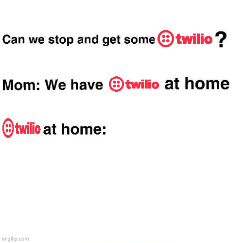

# About
SMSAutomator is my idea. A dumb idea, but mine nonetheless. 



## The Background
So I asked myself, why don't more people just run their own SMS service. We have so many cheap SIMs/smartphone lefterovers this would be a nice novel usecase for the serice. In addition you can actually build in data center tier "reliability" by creating multiple worker nodes (phones) that are in fact geographically hosted on seperate networks (imagine a network of workers distributed all around the world on cell grids, using their cell network for comms to the coordinator server). 

## So Why Don't They
Well it's illegal, more accurately using your personal line for business purposes without compliant infrastructure. https://www.twilio.com/en-us/resource-center/guide-to-us-sms-compliance. The tl;dr is that there is a large set of legal barriers in place to prevent this from being run. The reason for this is simple (spammers). 

## So how should I run this?
**AS A PRIVATE FOR PERSONAL USE ONLY TOOL. DO NOT ATTEMPT TO USE THIS FOR ANY TYPE OF CAMPAIGNS OR MASS CONTACT. I DO NOT SUPPORT THIS AND YOU WILL BE BANNED BY YOUR CARRIER**

## Ok so then why are you releasing it?
There are important things to know before you use this.
1. If you use this to run a real deal service you will be banned by whatever phone carrier you choose
    * Phone carriers can and do inspect SMS traffic for things like this
2. Just because someone can use this incorrectly does not mean this does not have a use case
    * Security concious users will always have a usecase for running their own inhouse services and one that can help provide additional 2FA security with relatively low lift is ABSOLUTELY worthwhile
3. I will be updating this tool to support the whitepaper released by Twilio. https://pages.twilio.com/rs/294-TKB-300/images/Guide%20to%20US%20Messaging%20Compliance.pdf


## How Do I Use This?
```bash
# Brings up the SMSServer/SMSFilter containers
docker compose up

# Building the sub images
# Build image for microsms
cd ./server
docker build -t microsms-server .
# Build the image for the filter server
cd ./smsfilter
docker build -t smsfilter-backend .
```
Note that there are configuration options to help you run this more distributed. If you want to know how to do that, read the docs. 


## What Is The Filter Server For?
LLMs offer a variety of tooling to help test text passages for "violations." In an attempt to help protect those that wish to run this system I have includued this service which helps check your texts for you. Using it is technically optional but I wouldn't risk. Reminder that SMS are sent plaintext and that if you decide to send messages that are "dangerous" over it, then I would expect to receive complaints or potentially a door knock

## What About Auth?
Doesn't exist right now, but I'm working on a nifty thrifty solution I like. Don't run this exposed to the internet, please.